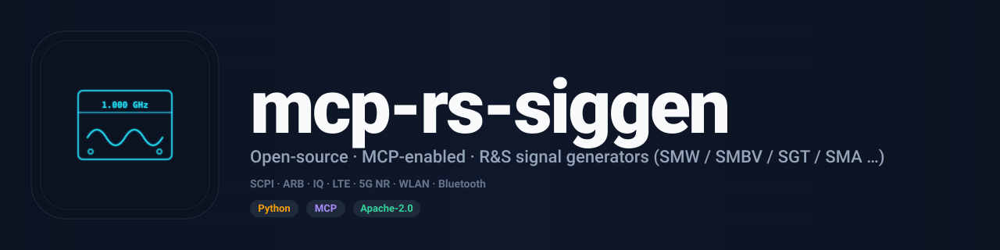

<div align="center">



<br/>

[](https://github.com/RFingAdam/mcp-rs-siggen/actions/workflows/ci.yml)
[](LICENSE)
[](https://www.python.org/downloads/)
[](https://modelcontextprotocol.io)
[](https://github.com/RFingAdam/eng-mcp-suite)

**Drive Rohde & Schwarz signal generators from any MCP-compatible AI client.**
**TCP/IP SCPI — 53 tools across CW / analog / IQ / ARB / digital-standard (LTE, 5G NR, WLAN, Bluetooth) signal generation.**

[Quick start](#quick-start) ·
[Tools](#tools) ·
[Workflows](#workflows) ·
[Documentation](#documentation)

</div>

---

> [!IMPORTANT]
> **Hardware required.** This MCP server controls real R&S signal
> generators over TCP/IP SCPI. You need actual **SMW / SMBV / SMM / SMCV /
> SGT / SGS / SMA / SMB / SMC** hardware on the network to be useful.
> The server is a thin driver — no built-in simulator. Generator-specific
> option licenses (e.g. K71 for 5G NR, K81 for WLAN) must be enabled on
> the unit for the matching tool surface to function.

## What is mcp-rs-siggen?

`mcp-rs-siggen` is a [Model Context Protocol](https://modelcontextprotocol.io)
server that automates R&S signal generators via direct TCP/IP SCPI. The
generator family covers vector (SMW200A, SMBV100B, SMM100A, SMCV100B), SGMA
RF sources (SGT100A, SGS100A), and analog/microwave generators (SMA100B,
SMB100B) — frequencies up to 67 GHz, IQ bandwidths up to 2 GHz.

Drive it from Claude Desktop, Claude Code, OpenAI Agents SDK, or any other
MCP client. The server handles CW output, analog modulation (AM/FM/PM/Pulse),
IQ modulation with impairment injection, ARB waveform playback, baseband
digital standards (LTE, 5G NR, WLAN, Bluetooth), sweeps, and pre-built signal
templates.

**What `mcp-rs-siggen` does well:**

- 🤖 **AI-native via MCP.** First-class [Model Context Protocol](https://modelcontextprotocol.io)
  server with 53 tools across 13 categories. Any Claude / LLM agent can drive
  it.
- 🐍 **Python + MCP surfaces.** Import `rs_siggen_mcp` for direct driver access,
  or run as an MCP server for AI-agent automation.
- ⚡ **Direct TCP/IP SCPI.** No VISA install needed; talks straight to port
  5025.
- ✅ **Digital-standards coverage.** LTE, 5G NR, WLAN, Bluetooth — single
  tool per standard with sensible defaults.
- 🔒 **AGPL-3.0-or-later.** SCPI-injection-guarded, path-traversal-protected,
  safety limits on power and frequency.

---

## Quick start

### Install

```bash
pip install rs-siggen-mcp
```

Or with [uv](https://docs.astral.sh/uv/):

```bash
uv pip install rs-siggen-mcp
```

From source:

```bash
git clone https://github.com/RFingAdam/mcp-rs-siggen.git
cd mcp-rs-siggen
uv sync --dev
```

### Configure

```bash
export SIGGEN_DEFAULT_HOST=192.168.1.100
rs-siggen-mcp
```

| Variable | Default | Description |
| -------- | ------- | ----------- |
| `SIGGEN_DEFAULT_HOST` | `192.168.1.100` | Generator IP |
| `SIGGEN_DEFAULT_PORT` | `5025` | SCPI TCP port |
| `SIGGEN_CONNECTION_TIMEOUT` | `5.0` | TCP connection timeout (s) |
| `SIGGEN_COMMAND_TIMEOUT` | `30.0` | SCPI command timeout (s) |
| `SIGGEN_MAX_POWER_DBM` | `20.0` | Max allowed output power |
| `SIGGEN_MIN_POWER_DBM` | `-140.0` | Min allowed output power |
| `SIGGEN_MAX_FREQUENCY_HZ` | `67e9` | Max allowed frequency |
| `SIGGEN_ALLOW_RAW_SCPI` | `true` | Enable raw SCPI commands |

### Two surfaces, same answer

<table>
<tr>
<td valign="top" width="50%">

**Python**

```python
import asyncio
from rs_siggen_mcp.driver import SiggenDriver

async def main():
    async with SiggenDriver("192.168.1.100", 5025) as sg:
        await sg.set_frequency(1e9)
        await sg.set_power(-10)
        await sg.output_on()
        # ... let receiver capture ...
        await sg.output_off()

asyncio.run(main())
```

</td>
<td valign="top" width="50%">

**MCP (Claude Desktop, Claude Code, any MCP client)**

```json
{
  "mcpServers": {
    "rs-siggen": {
      "command": "rs-siggen-mcp",
      "env": {
        "SIGGEN_DEFAULT_HOST": "192.168.1.100"
      }
    }
  }
}
```

Then ask your assistant:

> *"Connect to the siggen, set up a 5G NR 100 MHz signal at 3.5 GHz, −20 dBm, and turn the output on."*

The agent walks through `siggen_connect`, `siggen_configure_5gnr`,
`siggen_set_frequency`, `siggen_set_power`, `siggen_output_on`.

</td>
</tr>
</table>

### OpenAI Agents SDK

This server also plays nicely with the
[OpenAI Agents SDK](https://openai.github.io/openai-agents-python/mcp/):

```python
from agents import Agent
from agents.mcp import MCPServerStdio

async with MCPServerStdio(
    command="rs-siggen-mcp",
    env={"SIGGEN_DEFAULT_HOST": "192.168.1.100"},
) as siggen_server:
    agent = Agent(
        name="RF Test Engineer",
        instructions="You control R&S signal generators for RF testing.",
        mcp_servers=[siggen_server],
    )
```

---

## Tools

53 MCP tools, grouped:

| Group | Tools |
| ----- | ----- |
| **Connection** (6) | `siggen_discover`, `siggen_connect`, `siggen_disconnect`, `siggen_identify`, `siggen_get_status`, `siggen_get_model_info` |
| **RF Output** (5) | `siggen_set_frequency`, `siggen_set_power`, `siggen_output_on/off`, `siggen_set_phase` |
| **Analog Modulation** (5) | `siggen_configure_am/fm/pm/pulse`, `siggen_modulation_all_off` |
| **IQ Modulation** (3) | `siggen_iq_on`, `siggen_iq_off`, `siggen_configure_iq_impairments` |
| **ARB** (5) | `siggen_load_waveform`, `siggen_arb_on/off`, `siggen_set_arb_clock`, `siggen_list_waveforms` |
| **Digital Standards** (5) | `siggen_configure_lte/5gnr/wlan/bluetooth`, `siggen_generate_waveform` |
| **Sweep** (3) | `siggen_configure_freq_sweep`, `siggen_configure_power_sweep`, `siggen_configure_list_mode` |
| **Reference** (2) | `siggen_set_reference_source`, `siggen_get_reference_status` |
| **Calibration** (2) | `siggen_run_calibration`, `siggen_get_calibration_status` |
| **SCPI** (4) | `siggen_scpi_send`, `siggen_scpi_query`, `siggen_reset`, `siggen_preset` |
| **Templates** (3) | `siggen_list_templates`, `siggen_load_template`, `siggen_apply_template` |
| **State** (3) | `siggen_save_state`, `siggen_load_state`, `siggen_get_full_state` |
| **Limit Lines** (7) | `siggen_limit_create/list/remove/check/get_status/save/load` |

Full tool reference in [`docs/tools.md`](docs/tools.md).

---

## Supported instruments

| Model | Type | Max Frequency | IQ Bandwidth | Key capabilities |
| ----- | ---- | ------------- | ------------ | ---------------- |
| **SMW200A** | Vector | 67 GHz | 2 GHz | MIMO, digital standards, ARB |
| **SMBV100B** | Vector | 6 GHz | 1 GHz | Digital standards, ARB |
| **SMM100A** | Vector | 44 GHz | — | Modulation, ARB |
| **SMCV100B** | Vector | 7.125 GHz | — | Digital standards |
| **SGT100A** | SGMA vector | 6 GHz | 1 GHz | Compact, SGMA |
| **SGS100A** | SGMA CW | 12.75 GHz | — | CW-only, SGMA |
| **SMA100B** | Analog | 67 GHz | — | Ultra-low phase noise |
| **SMB100B** | Analog microwave | 40 GHz | — | Microwave |

---

## Signal templates

Built-in signal templates provide quick setup for common test scenarios.
Load by name with `siggen_load_template`, then `siggen_apply_template` to push.

| Template | Description |
| -------- | ----------- |
| `cw_1ghz` | 1 GHz CW at −10 dBm |
| `lte_10mhz` / `lte_20mhz` | LTE 10/20 MHz FDD |
| `nr_100mhz` | 5G NR 100 MHz |
| `wlan_80mhz` | WLAN 802.11ac 80 MHz |
| `bluetooth_le` | Bluetooth Low Energy |
| `two_tone_1mhz` / `two_tone_10mhz` | Two-tone with 1 / 10 MHz spacing |
| `fm_broadcast` | FM broadcast signal |
| `am_test` | AM test signal |
| `pulse_radar` | Pulse radar signal |

---

## Security

- **SCPI input sanitization** — all user-provided string parameters validated
  against injection patterns (semicolons, newlines, command sequences).
- **Path-traversal protection** — file paths for state save/load validated
  against directory traversal.
- **Raw SCPI guard** — direct SCPI command passthrough disablable via
  `SIGGEN_ALLOW_RAW_SCPI=false`.
- **Safety limits** — configurable maximum power and frequency clamps.
- **Async locks** — thread-safe access to shared mutable state.

See [SECURITY.md](SECURITY.md) for vulnerability reporting.

---

## Workflows

`mcp-rs-siggen` fits in the following [eng-mcp-suite](https://github.com/RFingAdam/eng-mcp-suite)
workflow bundles:

- **`lab-automation`** — pair with `copper-mountain-vna-mcp`,
  `mcp-rs-spectrum-analyzer`, and `mcp-rs-cmw500` for end-to-end RF
  bench-test workflows driven from a single agent session.
- **`rx-sensitivity`** — drive controlled stimulus while a sibling analyzer
  measures the result.

```bash
eng-mcp-suite install --workflow lab-automation
```

---

## Documentation

- 📘 **[Quick Start](docs/index.md)** — install through first call.
- 🛠️ **[Tool reference](docs/tools.md)** — every MCP tool, every argument.
- 📐 **[Usage examples](docs/usage.md)** — an RX-sensitivity sweep walkthrough.
- 🏗️ **[Architecture](docs/architecture.md)** — how this MCP fits in eng-mcp-suite.
- 📝 **[Changelog](CHANGELOG.md)**

---

## Part of eng-mcp-suite

<sub>This MCP server is part of</sub>

[](https://github.com/RFingAdam/eng-mcp-suite)

<sub>Part of [eng-mcp-suite](https://github.com/RFingAdam/eng-mcp-suite) — an open
umbrella of MCP servers for RF / EMC / PCB / signal-integrity engineering. Drop
into the `lab-automation` workflow bundle with
`eng-mcp-suite install --workflow lab-automation`.</sub>

| Domain                    | Sibling MCPs                                                                 |
| ------------------------- | ---------------------------------------------------------------------------- |
| **RF / Transmission lines** | [lineforge](https://github.com/RFingAdam/lineforge)                        |
| **EMC regulatory**        | [mcp-emc-regulations](https://github.com/RFingAdam/mcp-emc-regulations)      |
| **EM simulation**         | mcp-openems, mcp-nec2-antenna                                                |
| **Diagrams**              | [drawio-engineering-mcp](https://github.com/RFingAdam/drawio-engineering-mcp) |
| **Lab gear**              | [copper-mountain-vna-mcp](https://github.com/RFingAdam/copper-mountain-vna-mcp) · [mcp-rs-spectrum-analyzer](https://github.com/RFingAdam/mcp-rs-spectrum-analyzer) · mcp-rs-siggen · [mcp-rs-cmw500](https://github.com/RFingAdam/mcp-rs-cmw500) |

---

## Contributing

See [CONTRIBUTING.md](CONTRIBUTING.md) for development setup and guidelines.

---

## License

[AGPL-3.0-or-later](LICENSE). Relicensed from Apache-2.0 in v0.2.0 to
align with the eng-mcp-suite toolkit-wide AGPL move.

## Acknowledgments

- **Rohde & Schwarz** — for the published SCPI command references covering
  the SMW / SMBV / SGT / SGS / SMA / SMB / SMC families.
- **The MCP working group** — for the [Model Context Protocol](https://modelcontextprotocol.io)
  specification.

<div align="center">

<sub>Part of <a href="https://github.com/RFingAdam/eng-mcp-suite">eng-mcp-suite</a> — built for RF engineers, PCB designers, EMC labs, and AI agents.</sub>

</div>
